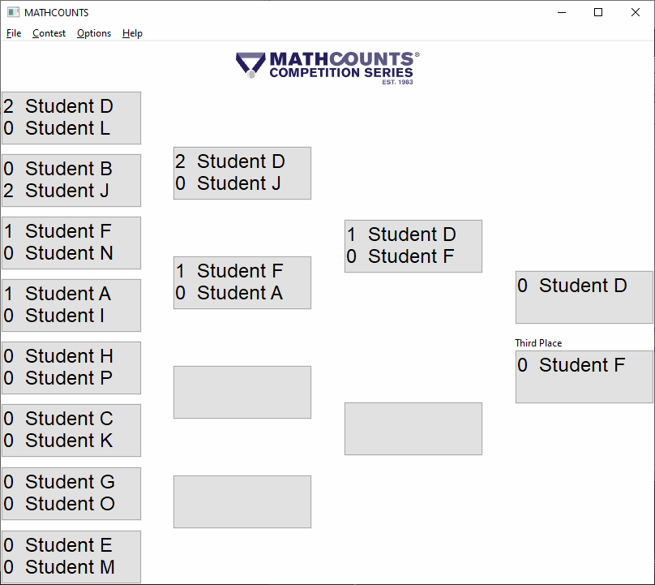
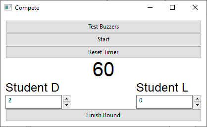
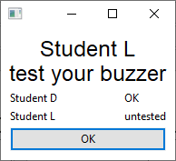

# MCbuzzer MATHCOUNTS Countdown Round

First written to support MATHCOUNTS countdown round at New Mexico
state competition in 2020. MCbuzzer graphical user interface
programming is in [WxPython](https://wxpython.org/), so that it will
work on major operating systems Windows, Mac, and Linux. 

The main window shows the state of the contest. Sixteen competitors
are randomly paired, and an elimination tree leads to first, second,
and third place competitor.

When the Countdown Round master of ceremonies clicks a contestant
pair, the contestants are placed into competition. 

To reduce or eliminate the confusion around which contestant is linked
with which buzzer, the MC can also click into the buzzer test window,
which requires each contestant to buzz in.

In addition to these basic capabilities, MCbuzzer offers first-line
features:
- Save the contestant names, buzzer configuration, and other options
  to a file. Each time a winner of a two-person contest is declared,
  the state of the competition is automatically saved. This allows
  resumption in the case of crash. Crash, by the way, is not a
  frequent occurence.
- Font size can be changed in case the display is projected on a low
  resolution (tested at 600x800) or high resolution projector is used.
- Buzzers send a keystroke to the computer. We use buzzers like those
  sold by [Affordable
  Buzzer](https://www.alignable.com/doylestown-pa/winking-fox-productions-llc-dba-affordable-buzzers),
  though can offer no endorsement.
  
The code is copyright by Park Hays, but it is released under GNU
General Public License 3.0. If you would like to contribute or request
a new feature, please contact the author.

Special thanks to Nick Davies for his creation of the Electron/React
application that inspired the design of MCbuzzer.
